# lsoas

Api and client for data on Local Authorities, Parliamentary Constituencies, Wards and Lower Layer Super Output Areas

## how local authorities voted in eu referendum

Green is leave red is remain - income inequality increased from left to right - number of deprived areas increases as you go up, size is size of local authority.  The darker the more marginal.  Deprivation is measure by proportion of LSOAs in bottom quintile for IMD.  Generally LAs with higher inequality - eg Cambridge have more dynamic economies than thoise with lower inequality eg Burnley.
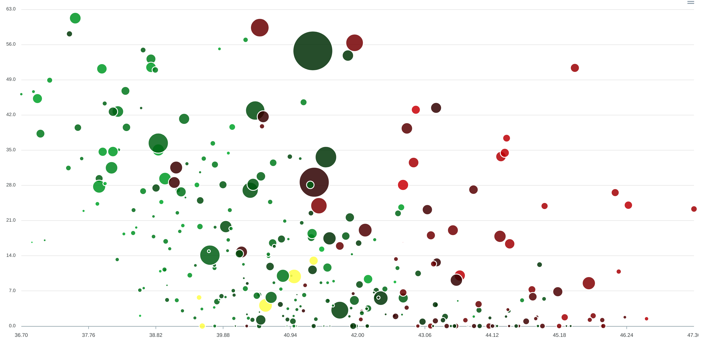

relates multiple deprivation score on Y axis against inequality on X axis for English LSOAS - areas of approx 1,500 people
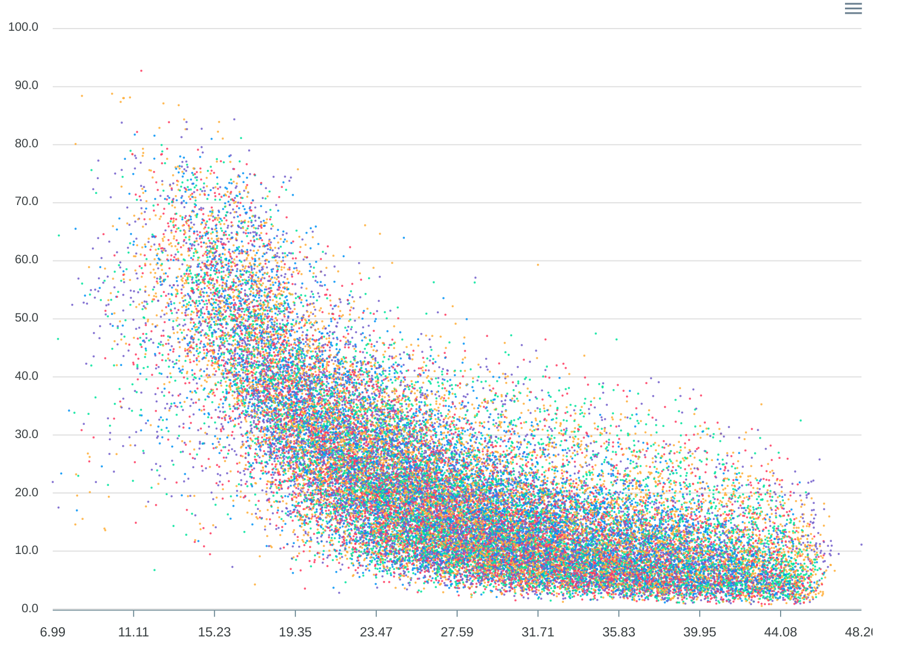

A1 - Urban major conurbation
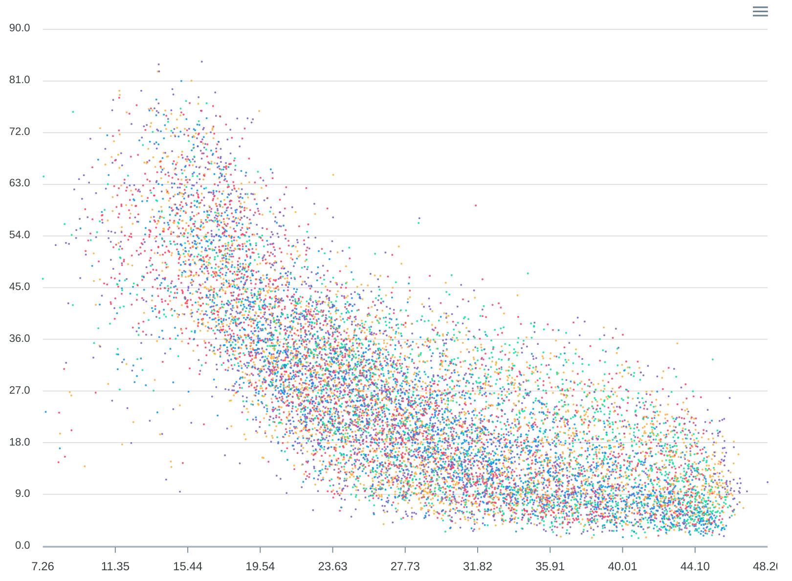

B1 - Urban minor conurbation
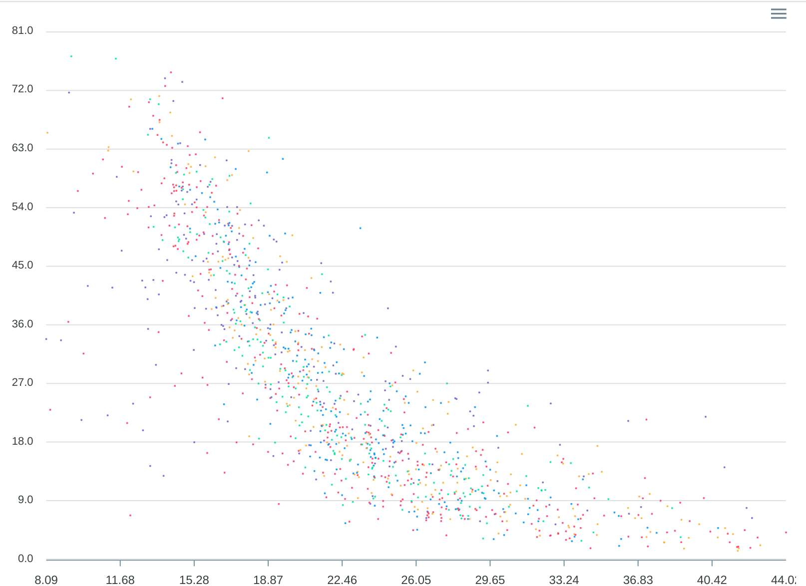

C1,Urban city and town
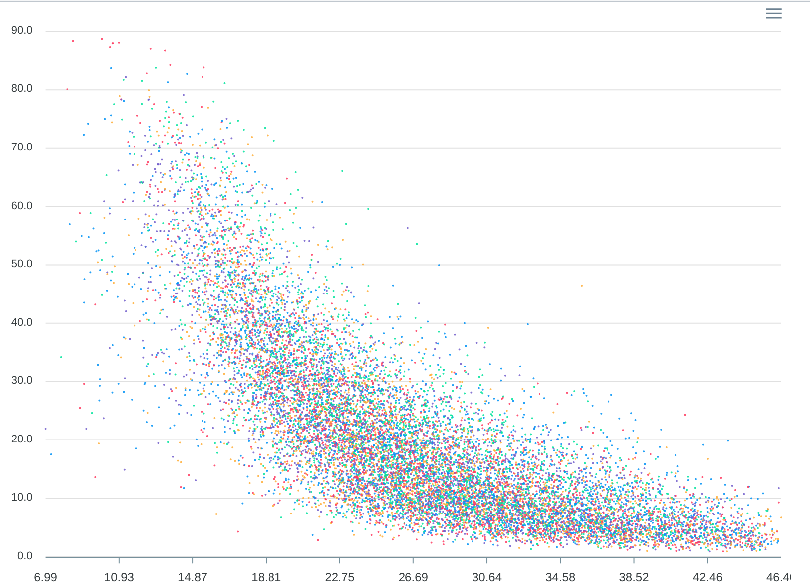

C2,Urban city and town in a sparse setting
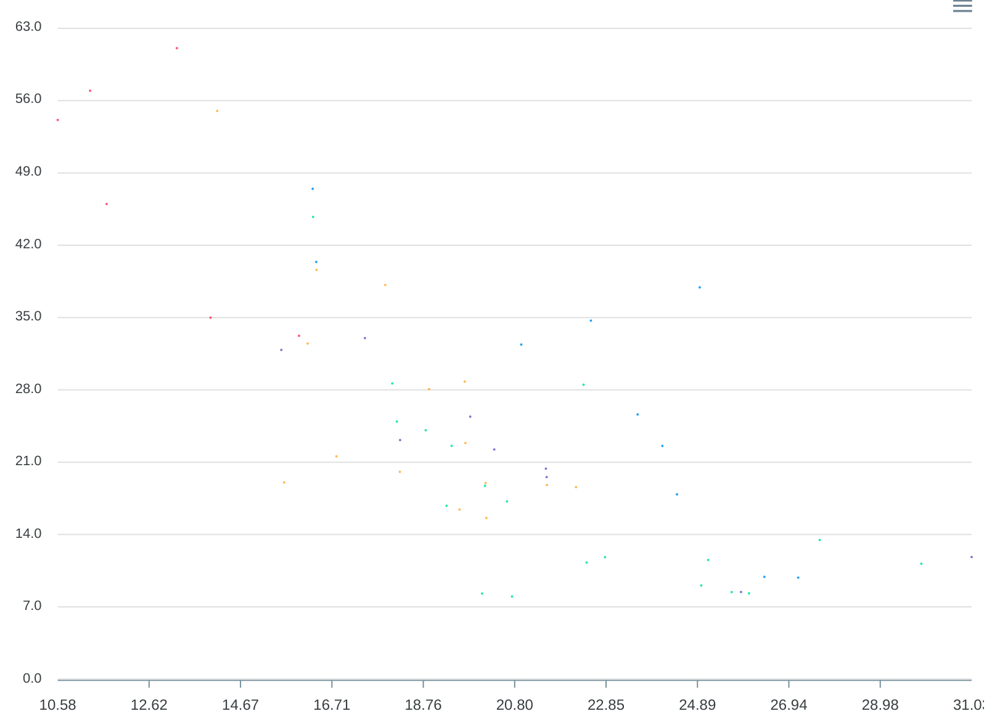

D1, Rural town and fringe
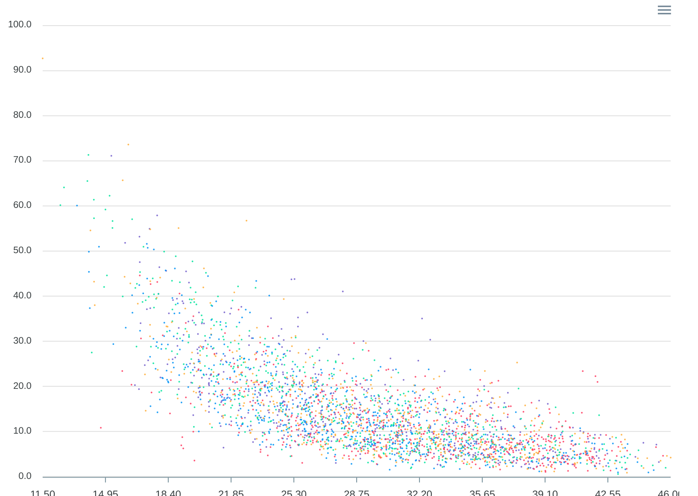

D2,Rural town and fringe in a sparse setting
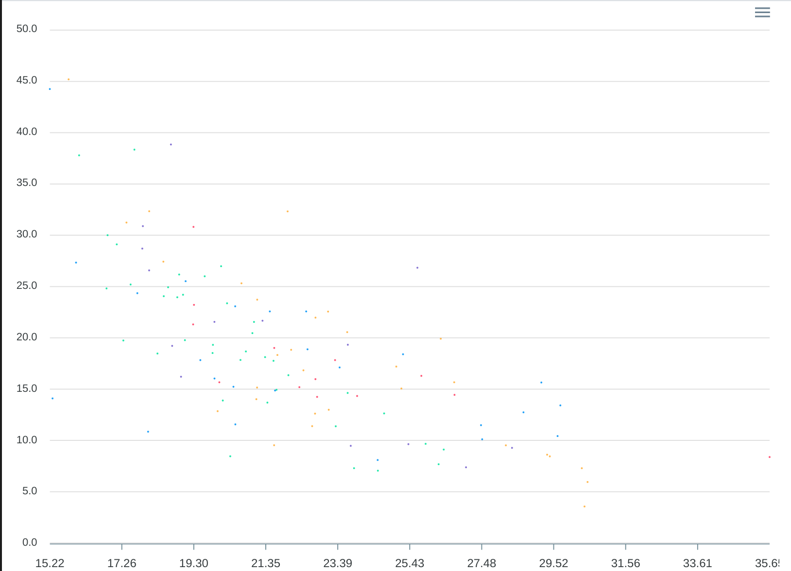

E1,Rural village and dispersed
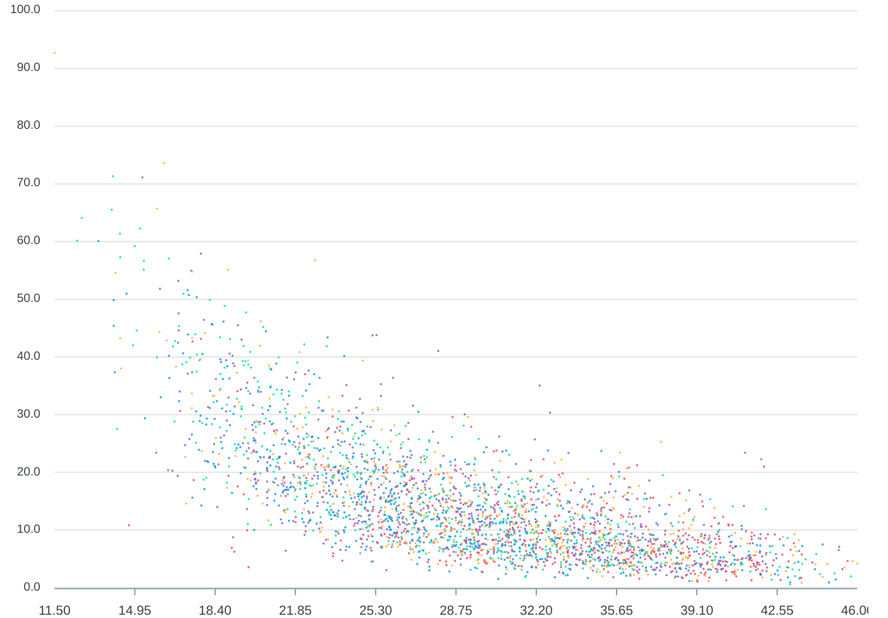

E2,Rural village and dispersed in a sparse setting
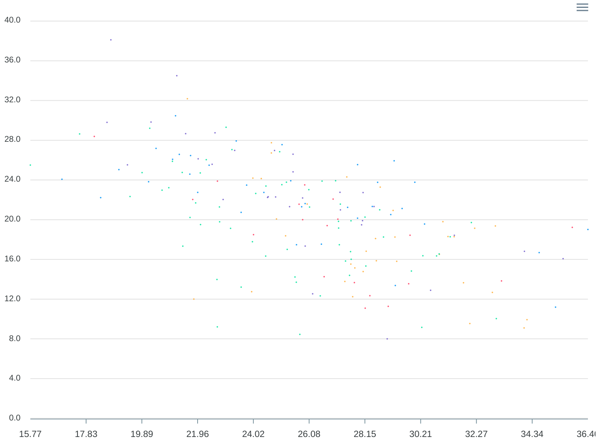

Local authorities inequality vs deprivation in highest third
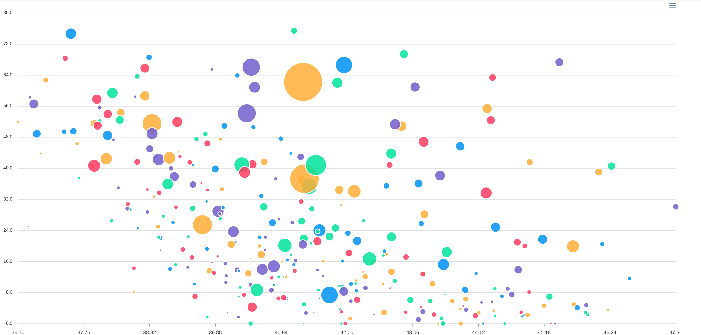

Local authorities inequality vs deprivation in lowest third
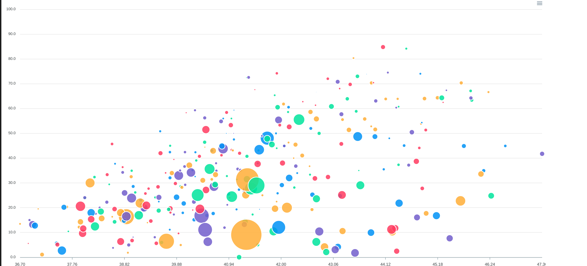
